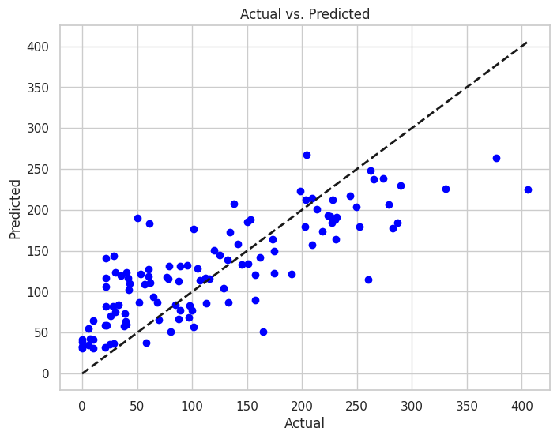

# 2024-Fantasy-Football-Predictions-Project

### Tableau Dashboard:

[Dashboard Link](https://public.tableau.com/app/profile/michael.sternbach/viz/FantasyFootballVisualization/Dashboard1)

## Summary

The goal of this project was to build a machine learning model that could predict a player's performance better than "experts" on sites like ESPN and NFL.com. It started as a group project for our data science class, and then became something that I and some of my other groupmates continued working on after graduation.

After trying out many different variables and techniques, we built optimal models for each position group given our available data. The models for rookie performance were a bit unreliable due to the lack of statistical data, but they were still overall pretty good at predicting who would be the top 3/5 performing rookies per position. However, the veteran models all had RMSE and R-squared values ranging from 55-75 and 0.5-0.63, respectively. They were also reliable in predicting which players would finish in the top 20, with accuracy ranging from 60%-80%, which is impressive considering many incorrect predictions were due to unforeseen injuries.

The predictions for the 2024 season are by no means perfect, but they provide a good estimate of a player's performance and can be a valuable tool for drafting a fantasy team.

## Data collection
### Statistical Data
*Collected by: Michael Sternbach and Conor Hughes*

This data contains all the statistical information we used. It was collected from [nfl verse](https://github.com/nflverse/nflverse-data/releases/tag/player_stats)

|player_id |player_name             |position|recent_team|season|games_played|completions|attempts|passing_yards|passing_tds|interceptions|sacks|sack_yards|sack_fumbles|sack_fumbles_lost|passing_air_yards|passing_yards_after_catch|passing_first_downs|passing_epa |passing_2pt_conversions|pacr       |dakota      |carries|rushing_yards|rushing_tds|rushing_fumbles|rushing_fumbles_lost|rushing_first_downs|rushing_epa |rushing_2pt_conversions|receptions|targets|receiving_yards|receiving_tds|receiving_fumbles|receiving_fumbles_lost|receiving_air_yards|receiving_yards_after_catch|receiving_first_downs|receiving_epa|receiving_2pt_conversions|racr        |target_share|air_yards_share|wopr        |special_teams_tds|fantasy_points|fantasy_points_ppr|
|----------|------------------------|--------|-----------|------|------------|-----------|--------|-------------|-----------|-------------|-----|----------|------------|-----------------|-----------------|-------------------------|-------------------|------------|-----------------------|-----------|------------|-------|-------------|-----------|---------------|--------------------|-------------------|------------|-----------------------|----------|-------|---------------|-------------|-----------------|----------------------|-------------------|---------------------------|---------------------|-------------|-------------------------|------------|------------|---------------|------------|-----------------|--------------|------------------|
|00-0000104|Troy Aikman             |QB      |DAL        |1999  |14          |258        |430     |2920         |17         |11           |19   |130       |5           |1                |0                |0                        |124                |36.24471432 |0                      |0          |1.32621242  |21     |10           |1          |2              |0                   |3                  |-8.846873051|0                      |0         |0      |0              |0            |0                |0                     |0                  |0                          |0                    |NULL         |0                        |NULL        |NULL        |NULL           |NULL        |0                |167.8         |167.8             |
|00-0000104|Troy Aikman             |QB      |DAL        |2000  |11          |153        |259     |1616         |7          |14           |13   |91        |2           |2                |0                |0                        |81                 |-29.087924  |1                      |0          |0.99540348  |10     |13           |0          |0              |0                   |5                  |-2.118868183|0                      |0         |0      |0              |0            |0                |0                     |0                  |0                          |0                    |NULL         |0                        |NULL        |NULL        |NULL           |NULL        |0                |63.94         |63.94             |
|00-0000145|Derrick Alexander       |WR      |KC         |1999  |16          |0          |0       |0            |0          |0            |0    |0         |0           |0                |0                |0                        |0                  |NULL        |0                      |NULL       |NULL        |2      |82           |1          |0              |0                   |1                  |5.45365649  |0                      |54        |103    |832            |2            |0                |0                     |0                  |0                          |31                   |22.726649    |0                        |0           |0.216717289 |NULL           |NULL        |0                |109.4         |163.4             |
|00-0000145|Derrick Alexander       |WR      |KC         |2000  |15          |0          |0       |0            |0          |0            |0    |0         |0           |0                |0                |0                        |0                  |NULL        |0                      |NULL       |NULL        |3      |45           |0          |0              |0                   |2                  |1.518605682 |0                      |72        |134    |1265           |9            |0                |0                     |0                  |0                          |51                   |36.46909667  |0                        |0           |0.253857667 |NULL           |NULL        |0                |185           |257               |
|00-0000145|Derrick Alexander       |WR      |KC         |2001  |13          |0          |0       |0            |0          |0            |0    |0         |0           |0                |0                |0                        |0                  |NULL        |0                      |NULL       |NULL        |2      |16           |0          |0              |0                   |1                  |0.731802382 |0                      |27        |68     |470            |3            |0                |0                     |0                  |0                          |22                   |2.118592931  |0                        |0           |0.163619062 |NULL           |NULL        |0                |66.6          |93.6              |

### Depth Chart Data
*Collected by: Michael Sternbach*

This data contains where each player was on the depth chart week 1 of every season.

Most of the data came from [nfl verse](https://github.com/nflverse/nflverse-data/releases/tag/depth_charts) while the rest was manually collected using pro football reference and espn.

|season    |club_code               |depth_team|player_id|position|depth_position|player_name|
|----------|------------------------|---|---|----|---|---|
|2024      |ARI                     |2  |00-0032398|WR  |WR |Chris Moore|
|2024      |ARI                     |2  |00-0038122|QB  |QB |Desmond Ridder|
|2024      |ARI                     |2  |00-0035500|WR  |WR |Greg Dortch|
|2024      |ARI                     |1  |00-0033553|RB  |RB |James Conner|
|2024      |ARI                     |1  |00-0035228|QB  |QB |Kyler Murray|

### Demographic Information
*Collected by: Alex Szczepanski*

This data sought to pull the height, weight, college, high school, high school state, place of birth, draft team, draft number/round, draft year, and birthday of every player in the dataset.

The data was from pro football reference collected using Selenium and BeautifulSoup in Python. The code used for this can be found [here](https://github.com/aszczep1/Fantasy_Football_Project/blob/main/Scrape_Info/Clean_Scraping_File.ipynb).

|player_name|feet                    |inches|weight(lbs.)|college|high_school_name|high_school_state|draft_team        |draft_info                                                                      |birthday  |
|-----------|------------------------|------|------------|-------|----------------|-----------------|------------------|--------------------------------------------------------------------------------|----------|
|Jared Goff |6                       |4     |217lb       |California|Marin Catholic  |CA               |Los Angeles Rams  |Draft: Los Angeles Rams in the 1st round (1st overall) of the 2016 NFL Draft.   |10/14/1994|
|Evan Engram|6                       |3     |240lb       |Mississippi|Hillgrove       |GA               |New York Giants   |Draft: New York Giants in the 1st round (23rd overall) of the 2017 NFL Draft.   |9/2/1994  |
|Shane Matthews|6                       |3     |196lb       |Florida|Pascagoula      |MS               |                  |                                                                                |6/1/1970  |
|Alec Pierce|6                       |3     |211lb       |Cincinnati|Glenbard West   |IL               |Indianapolis Colts|Draft: Indianapolis Colts in the 2nd round (53rd overall) of the 2022 NFL Draft.|5/2/2000  |
|Jared Cook |6                       |5     |246lb       |South Carolina|North Gwinnett  |GA               |Tennessee Titans  |Draft: Tennessee Titans in the 3rd round (89th overall) of the 2009 NFL Draft.  |4/7/1987  |

### Injury Data
*Collected by: Maggie Conners, Brett Gaebel, Conor Hughes, Michael Leahey, Michael Sternbach, and Alex Szczepanski*

This data collection sought to pull information on if the player was injured the prior season, injury type, injury severity, and if it was season-ending.

The data was collected by manually searching the internet and using various resources like Draft Sharks, Rotowire, Wikipedia, and other news outlets.

### Coaching Data
*Collected by: Conor Hughes*

This data contains the coach's name, team, season, first year with the team or not, years coached, wins, losses, and ties.

The data was manually collected from Wikipedia.

|coach_name|recent_team             |season|firstyearwithteam|years_coached|wins|loses|ties              |
|----------|------------------------|---|---|----|---|---|------------------|
|VinceTobin|ARI                     |1998|0  |2   |9  |7  |0                 |
|VinceTobin|ARI                     |1999|0  |3   |6  |10 |0                 |
|VinceTobin|ARI                     |2000|0  |4   |3  |13 |0                 |
|DaveMcGinnis|ARI                     |2001|1  |0   |7  |9  |0                 |
|DaveMcGinnis|ARI                     |2002|0  |1   |5  |11 |0                 |

## Data Preprocessing
*Conducted by: Michael Sternbachand and Alex Szczepanski[^1]*
- Creating new variables:
  - New team
  - Quarterback has over 4000 passing yards
  - Running back has over 1000 rushing yards
  - Receiver has over 1000 receiving yards
  - Fantasy points per game over previous 3 seasons
- Merging datasets
- Binning height, weight, and draft round
- Handling undrafted players
- Handling injury data
- Correlation analysis:
  

## Analysis
*Conducted by: Michael Sternbach and Alex Szczepanski*

### Models:
- Lasso Regression
- Random Forest
- XGBoost
- Gradient Boosting
- Voting Regressor

Each model was run for the rookie and veteran players of each position group. The models returned the feature importance, RMSE, R squared, a bar graph of the players with the top 10 projected fantasy points vs. their actual performance, and a scatter plot of the total predicted vs. actual performance. They were all tested on the 2023 season.

## Model Selection
*Conducted by: Michael Sternbach*

For each position group, each of the 5 above models was run for each of the previous 5 NFL seasons (2019 - 2023). For every time a model ran the optimal parameters, RMSE, R squared, number of players correctly guessed in the top 10 (top 3 or 5 for rookies) and number of players correctly guessed in the top 20 were recorded to a dataframe. The optimal model was then selected based on which one performed best on average. The chart below shows the model results for veteran wide receivers. 

| Model         | RMSE Mean  | RMSE Median | RMSE Std   | R2 Mean   | R2 Median | R2 Std    | Top 10 Accuracy Mean | Top 10 Accuracy Median | Top 10 Accuracy Std | Top 20 Accuracy Mean | Top 20 Accuracy Median | Top 20 Accuracy Std |
|---------------|------------|-------------|------------|-----------|-----------|-----------|-----------------------|------------------------|---------------------|-----------------------|------------------------|---------------------|
| Voting        | 57.030268  | 56.969201   | 1.819989   | 0.570139  | 0.567442  | 0.048914  | 0.52                  | 0.5                    | 0.130384            | 0.60                  | 0.6                    | 0.050000            |
| Random Forest | 57.590684  | 57.117570   | 1.792370   | 0.561624  | 0.565186  | 0.049530  | 0.50                  | 0.4                    | 0.141421            | 0.59                  | 0.6                    | 0.065192            |
| GB            | 57.775137  | 57.384449   | 2.598248   | 0.558021  | 0.561113  | 0.062149  | 0.50                  | 0.5                    | 0.158114            | 0.58                  | 0.6                    | 0.103682            |
| XGB           | 57.908113  | 57.423363   | 1.996870   | 0.556804  | 0.560518  | 0.051009  | 0.50                  | 0.5                    | 0.122474            | 0.59                  | 0.6                    | 0.065192            |
| Lasso         | 59.537655  | 60.114130   | 1.554259   | 0.532275  | 0.542096  | 0.042540  | 0.50                  | 0.5                    | 0.122474            | 0.59                  | 0.6                    | 0.065192            |

## Libraries Used

- pandas
- numpy
- matplotlib
- seaborn
- sklearn
- xgboost
- statsmodels.api
- scipy
- statistics
- math
- itertools
- warnings

[^1]: Alex built a logistic regression model for injury probability that ended up not being used
